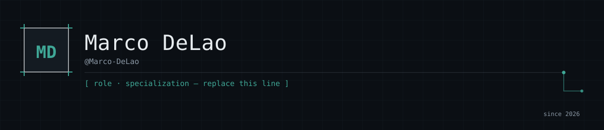
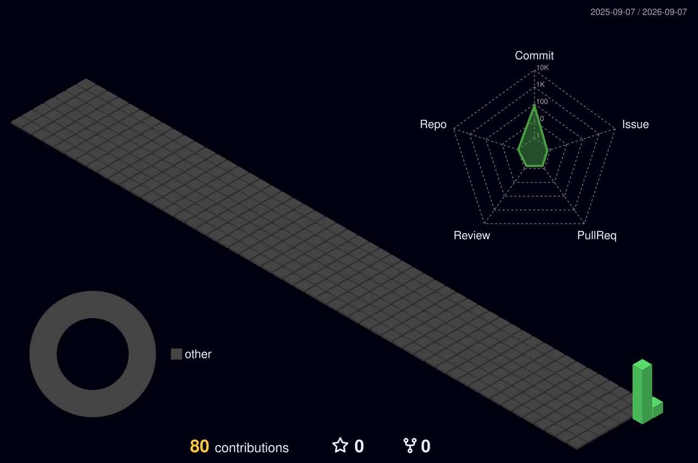

 

<h2 align="center">
  ♙ About me
</h2>

<table width="100%">
<tr>

<td width="64%" valign="top">

Hello there! I'm **Marco DeLao**, a Software Engineering student. I enjoy learning new technologies, building practical software, and turning ideas into working projects.

  

I'm constantly improving my programming skills, exploring new technologies, and working on projects that help me understand software development beyond the surface.

   

🎓 **Software Engineering Student**  
💻 **Software Development**  
⚙️ **Building & Learning**

</td>

<td width="36%" align="center" valign="middle">

</td>

</tr>
</table>

<h2 align="center">
  ⚙ Technologies
</h2>

 

 

 

<h2 align="center">
  📊 GitHub Activity
</h2>

  

 

 

<h2 align="center">
  ◉ Contributions
</h2>

 

<h2 align="center">
  🔗 Connect
</h2>

 
