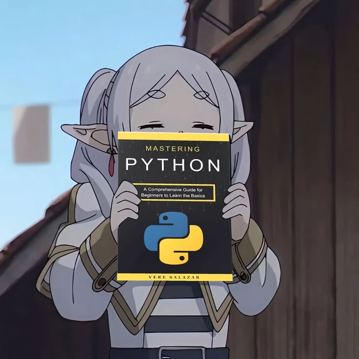

<h2 align="center">
  ꩜ About me
</h2>

<table width="100%" cellspacing="0" cellpadding="0" border="0">
<tr>

<td width="60%" valign="top">

Hello there! I'm **Marco DeLao**, a Computer Science student at **Alexandria University (FCDS)**, majoring in **Artificial Intelligence**. I'm particularly interested in **Deep Learning, AI models, and understanding the architecture behind intelligent systems**.

  

I enjoy turning what I learn into practical projects — from building AI agents using **Minimax and Alpha-Beta Pruning**, to analyzing real-world data with **Machine Learning**, and developing software systems using **Java OOP**.

 

🎓 **Computer Science Student · AI Major**  
🧠 **Deep Learning & Model Architecture**  
💻 **Python · Java · R**

</td>

<td width="40%" align="center" valign="middle"></td>

</tr>
</table>

 

<h2 align="center">
  ⚙ Technologies
</h2>

<table width="100%" cellspacing="0" cellpadding="0" border="0">
<tr>

<td width="40%" align="center" valign="middle">
  
</td>

<td width="60%" align="center" valign="middle">

  
  
  

   

  
  
  

</td>

</tr>
</table>

 

<h2 align="center">
  ᝰ GitHub Activity
</h2>

 

 

 

<h2 align="center">
  🔗 Connect
</h2>

<table width="930" cellspacing="0" cellpadding="0" border="0">
<tr>

<td width="558" align="center" valign="middle">

  

   

  

   

  

</td>

<td width="372" align="center" valign="middle">
  
</td>

</tr>
</table>

 
